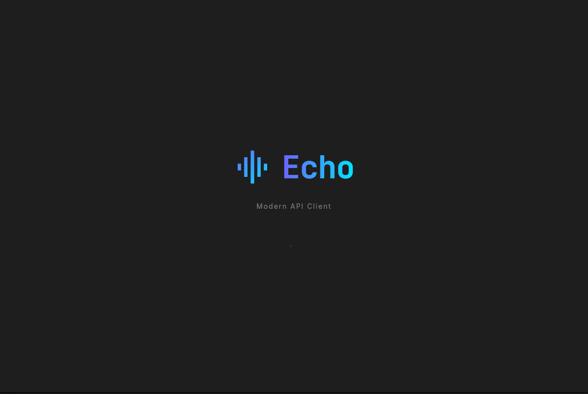
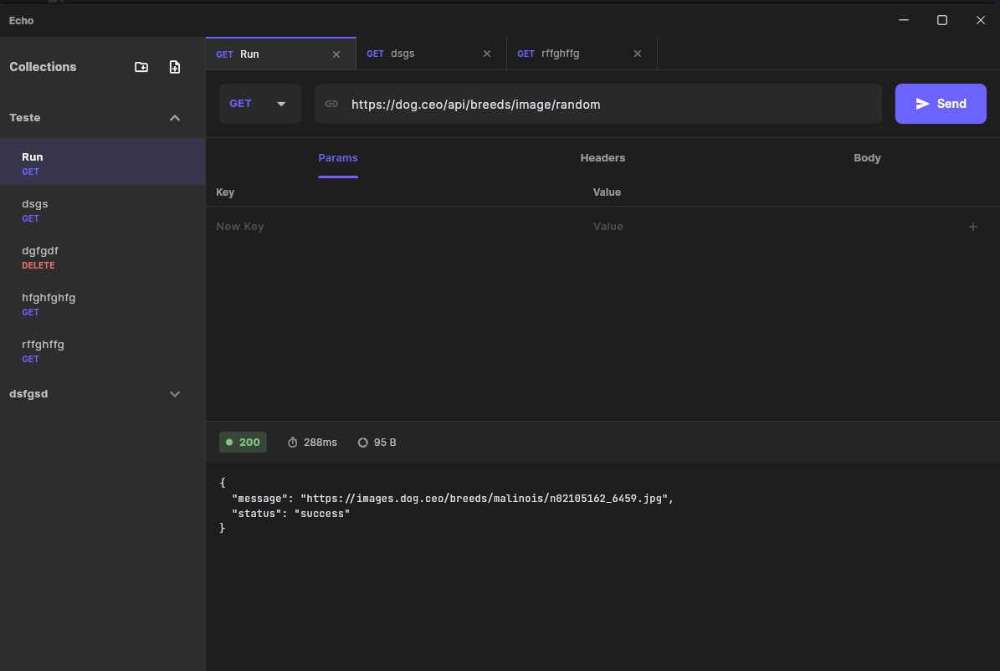

# Echo - Modern API Client for Linux



**Echo** is a lightweight, high-performance API Client built specifically for Linux desktops using Flutter. Designed with a clean, minimalist aesthetic inspired by tools like Linear and Raycast, Echo aims to provide a seamless developer experience for testing and debugging HTTP requests.

## ✨ Features

*   **🚀 High Performance**: Built with Flutter and compiled to native machine code for Linux.
*   **🎨 Modern UI**: Dark mode by default, clean typography (Inter & JetBrains Mono), and smooth animations.
*   **🗂️ Collections & Requests**: Organize your API requests into collections.
*   **📑 Tabbed Interface**: Open multiple requests simultaneously in tabs, just like your favorite IDE.
*   **💾 Local Persistence**: All data is stored locally using **Isar Database**, ensuring speed and privacy.
*   **🔄 Session Restoration**: Pick up exactly where you left off. Echo remembers your open tabs and active request.
*   **⚡ Smart Body Editor**:
    *   **JSON**: Real-time validation and auto-formatting (Prettify).
    *   **XML**: Basic validation and formatting.
    *   **Form URL Encoded**: Visual key-value editor for form data.
*   **🌈 Semantic Coloring**: HTTP methods and status codes are color-coded for quick recognition.
*   **📊 Response Metrics**: View status code, execution time, and response size at a glance.
*   **⬇️ Import Collections**: Import collections from Postman.

## 🛠️ Tech Stack

*   **Framework**: [Flutter](https://flutter.dev) (3.x)
*   **Language**: Dart
*   **State Management**: [Riverpod](https://riverpod.dev) (v2) with Code Generation
*   **Database**: [Isar](https://isar.dev) (NoSQL, ACID)
*   **HTTP Client**: [Dio](https://pub.dev/packages/dio)
*   **Window Management**: [window_manager](https://pub.dev/packages/window_manager)

## 📸 Screenshots



## 🚀 Getting Started

### Prerequisites

*   **Linux OS** (Ubuntu, Fedora, Arch, etc.)
*   **Flutter SDK** installed ([Guide](https://docs.flutter.dev/get-started/install/linux))
*   **Build Tools**: `clang`, `cmake`, `ninja-build`, `pkg-config`, `libgtk-3-dev`

### Installation

1.  **Clone the repository:**
    ```bash
    git clone https://github.com/yourusername/echo.git
    cd echo
    ```

2.  **Install dependencies:**
    ```bash
    flutter pub get
    ```

3.  **Generate code (Riverpod & Isar):**
    ```bash
    flutter pub run build_runner build --delete-conflicting-outputs
    ```

4.  **Run the app:**
    ```bash
    flutter run -d linux
    ```

## ⬇️ Importing Collections

Echo supports importing collections from other API clients.

### Postman

1.  Export your collection from Postman as a `JSON` file.
2.  In Echo, go to `File > Import`.
3.  Select `Postman Collection` from the dropdown.
4.  Choose your exported `JSON` file.
5.  Click `Import`.

## 🏗️ Architecture

Echo follows a simplified **Clean Architecture** pattern to ensure separation of concerns and maintainability:

*   **Presentation Layer**: Widgets, Screens, and Riverpod Providers (Controllers).
*   **Domain/Model Layer**: Data entities (`RequestModel`, `CollectionModel`, `SessionModel`).
*   **Data/Service Layer**: Repositories and Services (`IsarService`, `HttpService`).

## 🤝 Contributing

Contributions are welcome! Whether it's a bug fix, new feature, or UI improvement.

1.  Fork the project.
2.  Create your feature branch (`git checkout -b feature/AmazingFeature`).
3.  Commit your changes (`git commit -m 'Add some AmazingFeature'`).
4.  Push to the branch (`git push origin feature/AmazingFeature`).
5.  Open a Pull Request.

## 📄 License

This project is licensed under the MIT License - see the [LICENSE](LICENSE) file for details.

---

Built with ❤️ by [Kaike](https://github.com/kaikeventura) using Flutter.
